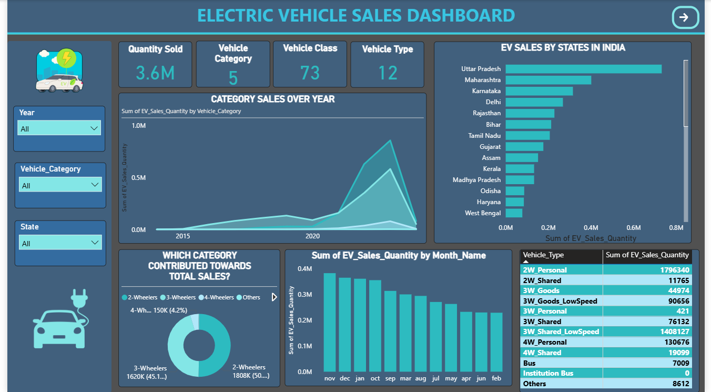
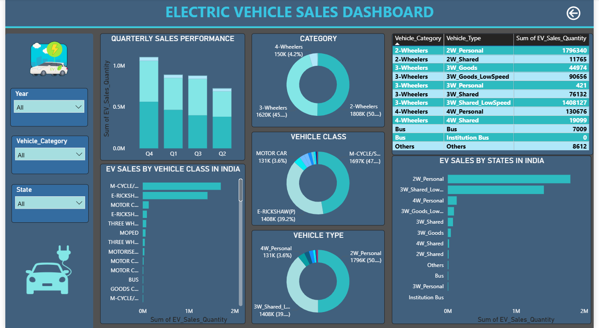

# ⚡ Electric Vehicle Sales Dashboard
## 📌 Project Description

This project focuses on analyzing Electric Vehicle (EV) sales trends across India. The interactive Power BI dashboard provides insights into vehicle categories, state-wise sales performance, monthly sales trends and vehicle type distribution. It helps stakeholders understand market demand, identify top-performing regions and track EV adoption patterns over time.

## ❗ Business Problem
- Rapid growth in EV adoption requires detailed sales monitoring
- Difficulty in identifying top-performing states and vehicle segments
- Lack of visibility into category-wise and monthly sales trends
- Need for a centralized dashboard to support business decisions

## 🎯 Key Objectives
- Analyze overall EV sales performance across India
- Identify top states contributing to EV sales
- Understand sales distribution across vehicle categories
- Track monthly and yearly EV sales trends
- Compare performance of different vehicle types
- Provide actionable insights for market expansion and strategy

## 🛠 Tech Skills
- Power BI → Dashboard Development & Data Visualization
- Power Query → Data Cleaning & Transformation
- DAX → KPI Calculations & Measures

## 🚀 Key Features
- 🚗 Total EV Quantity Sold → 3.6M
- 📂 Vehicle Categories → 5
- 🏷 Vehicle Classes → 73
- 🚘 Vehicle Types → 12
- 🗺 State-wise EV Sales Analysis
- 📈 Category-wise Sales Trend Over Years
- 📅 Monthly EV Sales Performance
- 🥧 Vehicle Category Contribution Analysis
- 📊 Vehicle Type Sales Breakdown
- 📊 Dashboard Insights
  
## 🗺 State-wise Sales Analysis
- Uttar Pradesh recorded the highest EV sales.
- Maharashtra and Karnataka are among the top-performing states.
- Northern and Western regions show stronger EV adoption.
  
## 🚗 Category-wise Contribution
- 2-Wheelers contribute the largest share of total EV sales.
- 3-Wheelers represent a significant portion of the market.
- 4-Wheelers have comparatively lower market share.
  
## 📈 Sales Trend Analysis
- EV sales have shown significant growth in recent years.
- Sharp increase observed after 2021, indicating rising adoption.
- Recent years contribute the majority of overall sales volume.
  
## 📅 Monthly Performance
- November and December recorded the highest sales.
- Consistent demand observed throughout the year.
- Seasonal fluctuations impact monthly sales performance.
  
## 🚘 Vehicle Type Analysis
- 2W Personal and 2W Shared dominate overall sales.
- 4W Personal vehicles show strong growth potential.
- Specialized segments contribute a smaller share of total sales.
  
## 📂 Project Files
- 📊 [Power BI Dashboard](Electric_vehicle_Analysis.pbix)
- 📄 [Dataset](electric_cleaned.csv)

## 📊 Key Insights
- 🥇 Uttar Pradesh leads EV sales among all states.
- 🛵 2-Wheelers account for more than half of total EV sales.
- 📈 EV adoption accelerated significantly after 2021.
- 📅 Year-end months consistently generate higher sales volumes.
- 🚘 Personal-use vehicles dominate the market compared to commercial segments.
- 🌱 India's EV market is experiencing strong and sustained growth.
  
## 🖼️ Dashboard Screenshot

## 📌 Conclusion

The Electric Vehicle Sales Dashboard provides a comprehensive overview of EV market performance across India. The analysis highlights top-performing states, dominant vehicle categories, and emerging sales trends. These insights can help businesses, policymakers and manufacturers make informed decisions regarding market expansion, infrastructure planning and future EV strategies.

## 🚀 Future Improvements
- Add EV growth forecasting using Machine Learning
- Integrate charging station analysis
- Include manufacturer-wise performance tracking
- Build drill-through reports for detailed state analysis
- Enable real-time dashboard updates

### 🔗 Connect With Me
### 💼 LinkedIn: www.linkedin.com/in/rohitjain173
### 💻 GitHub: github.com/RohitJain173
